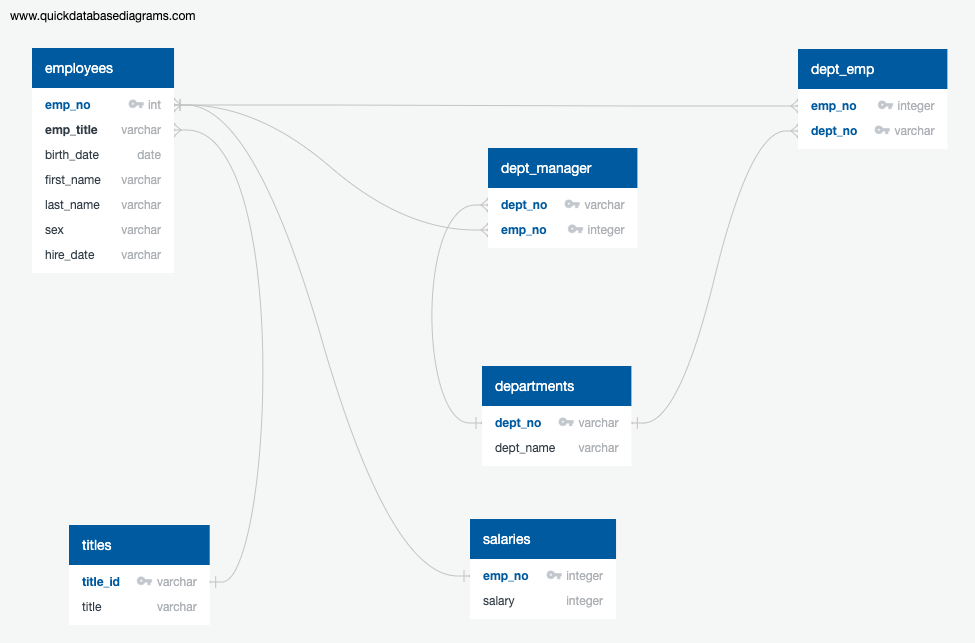
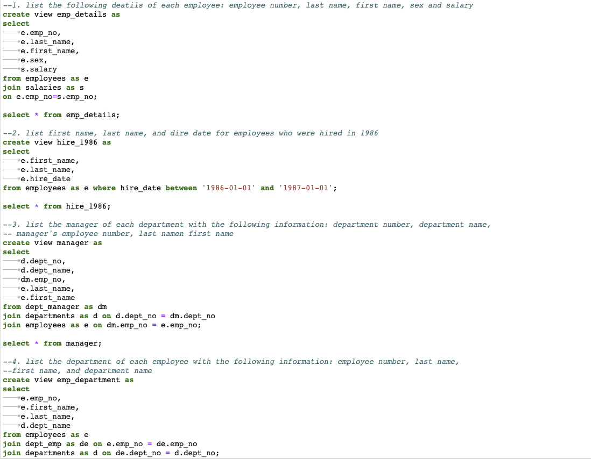

## Background

It is a beautiful spring day, and it is two weeks since you have been hired as a new data engineer at Pewlett Hackard. Your first major task is a research project on employees of the corporation from the 1980s and 1990s. All that remain of the database of employees from that period are six CSV files.

#### Data Modeling

Here we inspected the CSVs and sketched out an ERD of the tables.

#### Data Analysis

Here we have created various tables to display different employee and department informats as directed by our supervisor:

* Employee number, last name, first name, sex, and salary.

* First name, last name, and hire date for employees who were hired in 1986.

* The manager of each department with the following information: department number, department name, the manager's employee number, last name, first name.

* The department of each employee with the following information: employee number, last name, first name, and department name.

* First name, last name, and sex for employees whose first name is "Hercules" and last names begin with "B."

* All employees in the Sales department, including their employee number, last name, first name, and department name.

* All employees in the Sales and Development departments, including their employee number, last name, first name, and department name.

* In descending order, the frequency count of employee last names, i.e., how many employees share each last name.
